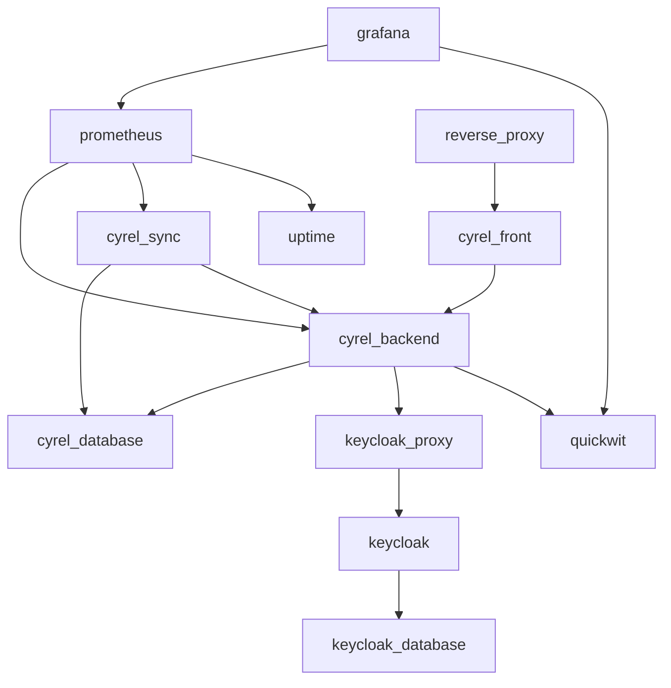

# Docker graded exercice

The project dockerized is named Cyrel.

## What is Cyrel?

Cyrel was a tool offered to students and teachers, allowing them to see their schedules, their assignments (as a
student,
of course), and to see available rooms.
It tended to replace an existing tool: Celcat which is only for schedules.
In addition to bringing together more services than Celcat, Cyrel aimed to provide a much faster and more user-friendly
version than the latter.
Cyrel was a succession of three major versions that included rewrite from scratch.

You may notice that I am using the past tense: Cyrel was discontinued in March 2024

## Cyrel architecture

### Cyrel frontend

Cyrel frontend is, like you can expect, the frontend of Cyrel.
It is written in [Dart](https://dart.dev/) with the [Flutter](https://flutter.dev/) framework.
With the power of Flutter, Cyrel was available on the web and Android (it was also working on Linux but was never
distributed).

### Cyrel backend

Cyrel backend handles anything except authentication.
It is written in [Kotlin](https://kotlinlang.org/) with the [Quarkus framework](https://quarkus.io/).
It uses a [postgresql](https://www.postgresql.org/) database to store users, schedule, homework, etc.

### cyrel-sync

cyrel-sync is the magic tool that fetches schedule from Celcat server.
It is directly connected to the same database as Cyrel backend.
It is written in Kotlin as well.

**This component was slightly changed from the original version, see more in [Docker part > Services](#services).**

## Global architecture

Cyrel contains three core components, but there are more components that can be plugged.
Will be presented here, the plugged components which were limited by my imagination (I do not think that any more
components can be added).

### Authentication

Authentication should be considered as one of the core components of Cyrel since it is required for Cyrel to work.
But since it is an external component and that it can be anything from the moment, it implements specific standards, it
was not considered as such.

Cyrel, at least the third version, was made for a school club: the Corpauration.
The Corpauration has multiple services where users can log in, so its requirement was to have a centralized
authentication system where users could sign in with a unique account.
Several systems exist for that and one, which is particularly popular, was chosen: openid connect with OAuth 2.
Few open source and/or free openid connect servers exist, but one among them is very well known and widely used:
[Keycloak](https://www.keycloak.org/).

### Uptime

Uptime is a component that permits getting if a service is up or not by doing HTTP calls on it.
Better Uptime was previously used when Cyrel was deployed but it is not a service that you can self-host.
So, here the tool [statping](https://statping-ng.github.io/) is used.

### Monitoring

Monitoring is a component or rather a group of components that are responsible for collecting metrics and provide a
way to visualize and analyse them.

Cyrel backend and cyrel-sync expose metrics trough that can be collected with [prometheus](https://prometheus.io/).
Prometheus is a software that records metrics in a time series database by pulling data from exposed HTTP API.
The uptime tool used also exposes metrics for prometheus.

Cyrel backend produces access logs that can be used for monitoring purposes.
Logs are stored in a directory.
A tool called [Vector](https://vector.dev/) reads log files, then parses each line using regular expressions and sends
them to a specialized database.
The specialized database used here is [Quickwit](https://quickwit.io/), which is an open-source alternative
to [Elasticsearch](https://www.elastic.co/elasticsearch) written in [Rust](https://www.rust-lang.org/).

Metrics and logs collected are analyzed and visualised with [Grafana](https://grafana.com/).
Grafana is open-source analytics and interactive visualization software.
It can connect to multiple datasources (extensible with a plugin system) and then enable dashboard creation with
visualizations from the datasources.

## Docker part

In this section, the dockerisation of these components of Cyrel is explained.
For the sake of simplicity, the dockerisation uses docker compose that permits defining and running multi-container
applications.
It groups services, networks and volumes management in a single YAML configuration file.
And then enables with a single command to manage those resources.

### Services

#### cyrel_database

cyrel_database is a postgresql 15 database using `postgres:15` image.
It is the database used by Cyrel backend (cyrel_backend) and cyrel-sync (cyrel_sync).
It has a volume `cyrel_backend_db` to persist database data.

#### cyrel_backend

cyrel_backend is the backend of Cyrel.
It builds its custom image.
It uses multi-stage in the Dockerfile, which permits having a build environment where output files are copied in the
final image.
Its advantage is that the final image takes less storage space.

The build stage uses `alpine:latest`, retrieves the necessary files, apply some patches then build Cyrel backend.
It also retrieves Vector for log monitoring.

Then the final image is based on `registry.access.redhat.com/ubi8/openjdk-17:1.14`.
It copies the necessary files from the build stage and from the host.

The cyrel_backend service has a volume `cyrel_logs` to persist logs and exposes port 8081.

#### cyrel_sync

cyrel_sync builds its custom image.
It is also a multi-stage Dockerfile.

The build stage uses `alpine:latest`, retrieves the necessary files, apply some patches then build cyrel-sync.
Then the final image is based on `registry.access.redhat.com/ubi8/openjdk-17:1.14`.
It copies the necessary files from the build stage and from the host.

The patch file disables the usage of Celcat (which needs Celcat credentials) and enables the usage of a JSON file for
schedule data.

Then the final image is based on `registry.access.redhat.com/ubi8/openjdk-17:1.14`.
It copies the necessary files from the build stage and from the host.

The cyrel_sync service exposes port 8082.

#### cyrel_front

cyrel_front is the frontend of Cyrel.
It also builds its custom image using a multi-stage Dockerfile.

The build stages uses `debian:bookworm-slim`, retrieves the necessary files (flutter and the source code), applies some
patches then builds Cyrel frontend.

Then the final image is based on `httpd:2.4`.
It copies the necessary files from the build stage and installs curl for health checks.

The cyrel_front service uses the scaling system of docker compose and defaults to three instances.

#### reverse_proxy

reverse_proxy is a reverse proxy using `nginx:1.27-alpine` image.
It is the reverse proxy in front of the different instances of cyrel_front.

It has a volume mapping the file `nginx.conf` to `/etc/nginx/nginx.conf` and exposes port 8080

#### keycloak_database

keycloak_database is a postgresql 15 database using `postgres:15` image.
It is the database used by Keycloak (keycloak).
It has a volume `keycloak_db` to persist database data.

#### keycloak

keycloak is the authentication software used by Cyrel.
It builds its custom image.

The Dockerfile uses the image `keycloak/keycloak:26.0`.
And includes the necessary configuration file and a binary for healthcheck.

#### keycloak_proxy

keycloak_proxy is a reverse proxy using `nginx:1.27-alpine` image.
It is the reverse proxy in front of keycloak.

The proxy is necessary for two reasons.
The first one is because of a design choice of Keycloak which makes it really hard to be dockerized.
Indeed, multiple linked services cannot talk to Keycloak with different networks.
For example, if users' browser talks to Keycloak for authenticating through a public network and then a backend verifies
tokens issued by Keycloak to the users by using a private network, then Keycloak will deny the verification.
This is exactly what we have with Cyrel: users authenticate through their browser using the host network.
But when users talk to Cyrel backend, the backend will verify the users' token by talking to Keycloak through a bridge
network.
So using a reverse proxy that captures browser and backend traffic and makes it pass through a unique bridge network,
solves this problem.
The second reason is that it permits Keycloak scaling.
**Please note that the load balancing algorithm used by docker compose is really naive and does not track connection so
it randomly redirects the traffic to a Keycloak node.**
This causes some problems, especially in the authentication process which is stateful.

It has a volume mapping the file `keycloak/nginx.conf` to `/etc/nginx/nginx.conf` and exposes port 8083

#### uptime

uptime is the service providing uptime information for cyrel_backend, cyrel_sync, reverse_proxy, keycloak_proxy and
grafana.
It uses the software statping or rather a fork: statping-ng since the original was discontinued.
It builds its custom image.

The Dockerfile uses the image `ghcr.io/statping-ng/statping-ng:0.91.0` and includes a script that bootstrap statping
data with right configurations.

The uptime service has a volume `statping` to persist data and exposes port 3001.

#### quickwit

quickwit is the service storing the logs sent by Vector in cyrel_backend service.
It builds its custom image.

The Dockerfile uses the image `quickwit/quickwit:0.8.1` and includes a script that configure the schema of stored logs.

The quickwit service has a volume `quickwit` to persist quickwit data.

#### prometheus

prometheus is the service that collects metrics from Cyrel backend, cyrel-sync and statping.
It uses the image `bitnami/prometheus:3.0.1` and has two volumes: `prometheus` to persist prometheus data and map the
file `prometheus.yml` to `/opt/bitnami/prometheus/conf/prometheus.yml`.

#### grafana

grafana is the service that provides a dashboard to visualize and analyse metrics from quickwit and prometheus.
It uses the image `grafana/grafana:11.3.1` and has five volumes:

- `grafana` to persist grafana data
- `grafana/datasources.yaml` which is mapped to `/etc/grafana/provisioning/datasources/datasources.yaml`
- `grafana/dashboards.yaml` which is mapped to `/etc/grafana/provisioning/dashboards/dashboards.yaml` and
  `/usr/share/grafana/conf/provisioning/dashboards/dashboards.yaml`
- `grafana/dashboards` which is mapped to `/usr/share/grafana/dashboards`

The last three are for datasources and dashboard configurations.

The service exposes the port 3000.

### Services dependencies

Every service is inter-linked with each other.

You can see below the dependency graph of all services:

Docker compose boots a service once all its dependencies have been booted.

I will not explain obvious relation as why a service requires a database to run but a less obvious one.
You may notice that cyrel_sync requires cyrel_backend to run.
Indeed, while cyrel_sync theoretically only depends on cyrel_database, it has no way of defining the table schemas.
This is handled by cyrel_backend which at startup runs database migration.
So cyrel_sync needs to wait that migrations were successfully applied before booting.

### Network architecture

There are multiple networks involved that are all of the bridge type:

- net_cyrel_db: To put cyrel_database, cyrel_backend and cyrel_sync in the same network.
- net_front: To put cyrel_front and reverse_proxy in the same network.
- net_keycloak_db: To put keycloak_database and keycloak in the same network.
- net_auth: To put cyrel_backend, keycloak and keycloak_proxy in the same network.
- net_uptime: To put cyrel_backend, cyrel_sync, reverse_proxy, keycloak, uptime and grafana in the same network.
- net_metrics: To put cyrel_backend, cyrel_sync, uptime, quickwit, prometheus and grafana in the same network.

You can see that networks isolate part of the services: the databases cannot be reached by the frontend, for example.

### Health checks

Health checks are extensively used to make sure that a service is working as expected.
This is really useful for dependencies where, for example, cyrel_sync waits for cyrel_backend to be healthy (i.e.,
cyrel_backend accept HTTP connection: the migrations are applied) before starting.

### Scaling

I am using scaling from docker compose.
It permits with a command to scale services.
Its only drawback is that it does the load balancing naively.
Indeed, it does not track connection made by a client, so, if I load a web page, it will take the JavaScript and HTML
from random nodes.
It is a problem for Keycloak, which is stateful for the authenticating process.

## Instructions

Note that Cyrel frontend redirects the browser to specific urls like Keycloak or that it makes the browser through
JavaScript do requests to the backend of Cyrel.
THis is a problem since we need to hardcode where are these urls i.e. localhost if we are accessing them on the same
machine where containers run or to a private/public ip/domain name.
This concern was exposed to the professor who says that for the exercises this is alright if this is hardcoded to
localhost.
For other purposes, other solutions may need to be looked into.

### Requirements

Running this exercise requires a set of conditions:

- Have a 64-bit architecture
- Have at least 4 GB of free memory
- Have at least 9 GB of free storage
- Have the following ports free:
    - 3000
    - 3001
    - 8080
    - 8081
    - 8082
    - 8083
- The latest version of docker, docker-compose and docker-buildx

### Starting

To start, just do a `docker compose up`.

cyrel_backend, cyrel_sync and cyrel_front may take some time to build.
Since they are a lot of services, please be patient!
For information, it tooks 35 minutes to build on my worst hardware and 10 minutes on my best hardware.

When everything is up and healthy, you can access Cyrel at http://localhost:8080
You will then arrive at a page asking you to log in.
When you click on the log-in button, you will be redirected to Keycloak.
Please create a new account with an email **containing `@cy-tech.fr`** (Cyrel backend denies account not coming from
this domain).
Please note that you can put anything you want before the `@`.
When registered, you will be redirected to Cyrel.
It will be your first login, so Cyrel will ask you for some information.
The first one is the question: Are you a student or a professor?
Please choose `student`, if you choose `professor` you will be blocked by the manual verification process which was done
at the time by doing a SQL query which I want to protect you from.
Then it will ask your student number, please enter a number between 22000000 and 24000000 (not inclusive).
Then, from here, the setup should be straightforward.

You can access Grafana at http://localhost:3000
Please use `admin` `admin` as credentials.
There are two dashboards available: one for Cyrel and another one for statping.

You can access statping at http://localhost:3001
If you want to log in to the dashboard (unecessary), it is the same credentials as Grafana.

### Scaling

By default, cyrel_front is scaled with three instances.
You can change that with `docker compose scale cyrel_front=N` where `N` is a number between 1 and your system limits.

You can scale Keycloak, but like it was said above, it is not recommended but should be fine once you logged in (and it
is fun to watch Keycloak instances synchronizing themselves) with `docker compose scale keycloak=N` where `N` is a
number between 1 and your system limits.
